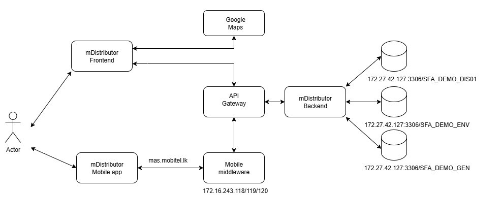

# Project: <mDistributer> 
- Line Manager:
- Application Owner:
- Developer:

## Application Overview
mDistributer is a project consisting of a Next.js based web application, a mobile application and a backend spring boot based application.

## Application Architecture
The application follows a client-server architecture. Below is a brief overview of the network architecture:

## Frontend Technology summery:
- Technology : Next.js
- homepage : 
- LB URL: 
- Jenkins URL: 
- Health Probe URL:

## Backend Technology summery:
- Technology: Spring framwork 3.3.3
- Java Version: 21
- DataBase: MySQL
- LB URL:
- Jenkins URL:
- Health Probe URL:  

"# nextjs-test" 
